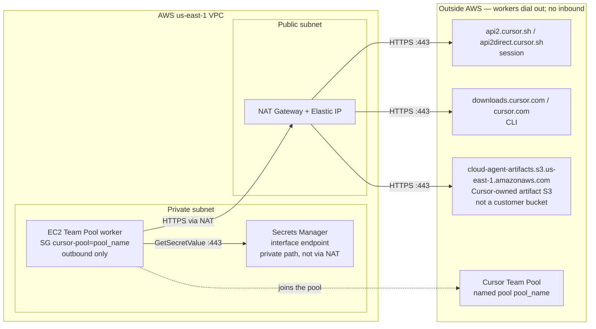

# Cursor Team Pool dry-run

A multi-phase lab for running [Cursor Team Pools](https://cursor.com/docs/cloud-agent/self-hosted/pool) on AWS. Phase A is a single Amazon Linux 2023 worker you can apply and destroy. Later phases are stubs.

This is a dry-run, not a production module. Use a lab account you can tear down. Do not commit API keys, filled-in tfvars, or Terraform state.

## My Machines and Team Pools

Both are [Self-Hosted Machines](https://cursor.com/docs/cloud-agent/self-hosted). Cursor runs the agent loop. A worker on your machine edits files and runs commands. The worker opens an outbound HTTPS connection to Cursor. Nothing dials inbound to the worker.

**My Machines** is a personal worker: your devbox or a spare VM, signed in with a browser login or a personal user API key. Several agents can share that machine. A service account API key cannot start a My Machines worker.

**Team Pools** is shared team capacity. Workers join a pool name, and each Cloud Agent claims one worker. Pool workers authenticate with a **service account API key** only. Personal, user, team, and organization API keys are rejected. A team admin turns on **Allow Self-Hosted Machines** before anyone can send a run to the pool.

## Phases

| Phase | Path | Status | What it covers |
| --- | --- | --- | --- |
| A | [phase-a/](phase-a/README.md) | Apply-ready | One AL2023 EC2 worker in a private subnet with NAT (`private_nat`, the enterprise-shaped dry-run default). `public_lab` is optional to skip NAT cost. Secrets Manager for the service account key, security group tagged `cursor-pool`, strict egress to Cursor A records captured at apply time |
| B | [phase-b/](phase-b/README.md) | Stub | Worker controller and per-claim session tokens, so the service account key stays off the worker |
| C | [phase-c/](phase-c/README.md) | Stub | Placeholder for scaling, a custom AMI, or tighter networking |

Start with the [Phase A operator path](phase-a/README.md). The enterprise-shaped default is a private subnet plus NAT in `us-east-1`. NAT carries HTTPS to the session hosts, the CLI hosts, and Cursor's artifact bucket. Secrets Manager stays on the interface endpoint. `public_lab` is optional and skips that NAT cost by placing the worker in a public subnet. The [Phase A README](phase-a/README.md) has the full diagram.

## Secrets

Terraform creates an empty Secrets Manager secret. The service account key is written afterward with `aws secretsmanager put-secret-value`. The key is not an input variable, is not in `terraform.tfvars`, and is not stored in Terraform state.
