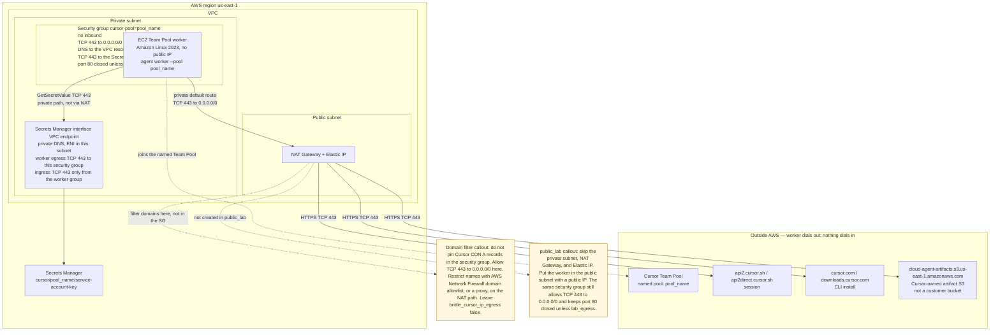

# Phase A — one Team Pool worker

One Amazon Linux 2023 EC2 instance that joins a Cursor Team Pool. Terraform creates the instance, an empty Secrets Manager secret, and a security group tagged `cursor-pool=<pool_name>`. You put the service account key in the secret after apply. The key is never a Terraform variable, never in `terraform.tfvars`, and never written to state (there is no secret version resource).

Stack path: `phase-a/terraform/`.

## Operator path

1. **Allow Self-Hosted.** A team admin opens the Cloud Agents dashboard and turns on **Allow Self-Hosted Machines**. Leave **Require Self-Hosted Machines** off unless every Cloud Agent run should land on your workers. Create a **team service-account key** on that same team: Dashboard, then Settings, then Service accounts. The key has to come from the team that owns the pool, with Allow Self-Hosted on. A personal API key or an admin API key will not start a pool worker. User, team, and organization API keys are rejected the same way.
2. **tfvars.** From `phase-a/terraform/`:

   ```bash
   cp terraform.tfvars.example terraform.tfvars
   ```

   Set `aws_region`, `pool_name`, `network_mode`, and `lab_egress`. Leave `brittle_cursor_ip_egress` false. Set `enable_ssm` only if you need a Session Manager shell. Do not add the API key.
3. **apply.**

   ```bash
   terraform init
   terraform apply
   ```

4. **put-secret-value.** The value has to be the team service-account key from step 1, from the same team that owns the pool. Write it with `printf` so the file has no trailing newline. `echo` and most editors add one, and a trailing newline makes the worker reject the key. Check the file without printing the key, load it, then delete the file.

   ```bash
   umask 077
   printf '%s' 'paste-the-service-account-key' > service-account-key.txt

   # Does not print the key. Expect line_count=1 and trailing_newline=no.
   bytes=$(wc -c < service-account-key.txt | tr -d ' ')
   prefix=$(head -c 4 service-account-key.txt)
   line_count=$(awk 'END { print NR+0 }' service-account-key.txt)
   last_byte=$(tail -c 1 service-account-key.txt | od -An -tu1 | tr -d ' ')
   trailing_newline=no
   if [[ "$last_byte" == "10" ]]; then
     trailing_newline=yes
   fi
   echo "bytes=${bytes} prefix=${prefix} line_count=${line_count} trailing_newline=${trailing_newline}"
   if [[ "$line_count" != "1" || "$trailing_newline" == "yes" ]]; then
     echo "Refusing to upload: write the key with printf '%s' so the file is one line and has no trailing newline." >&2
     exit 1
   fi

   aws secretsmanager put-secret-value \
     --region us-east-1 \
     --secret-id "$(terraform output -raw secret_arn)" \
     --secret-string file://service-account-key.txt
   rm -f service-account-key.txt
   ```

   `terraform output put_secret_value_command` prints the `put-secret-value` command for your region and secret ARN. The worker start script strips surrounding whitespace and newlines before it exports `CURSOR_API_KEY`, then runs `agent worker --pool <pool_name> start`. The unit retries `GetSecretValue` until the value exists.
5. **verify.** In Cursor, open [cursor.com/agents](https://cursor.com/agents), choose **Any repo**, and open the pool named by `pool_name`. A connected worker shows up there. There is no inbound SSH. Session Manager is off unless `enable_ssm = true`. With that set, `private_nat` reaches the SSM APIs through the NAT because TCP 443 is open. SSM interface endpoints are optional and are not created here. See [Troubleshooting](#troubleshooting) if the pool never appears.
6. **destroy.**

   ```bash
   terraform destroy
   ```

   The lab default `secret_recovery_window_in_days` is `0`, so destroy deletes the secret immediately. Use 7 or more outside a lab.

## Networking

The default is `network_mode = "private_nat"` in `us-east-1`. The worker has no public IP. It dials out through a NAT gateway to Cursor's session hosts, CLI hosts, and Cursor-owned artifact bucket. GetSecretValue stays on the Secrets Manager interface endpoint and does not use the NAT gateway. Nothing on the internet opens a connection to the worker.

In `private_nat`, the worker security group allows outbound TCP **443** to `0.0.0.0/0`. Security groups match IP addresses, not hostnames. `cursor.com` and `downloads.cursor.com` are CDN-hosted, and those A records rotate. Resolving them at apply time and allowing only those `/32`s made user-data hang on `curl: (28) Failed to connect to cursor.com:443`, so the worker binary never installed. Domain filtering belongs on the NAT or egress path: an [AWS Network Firewall](https://docs.aws.amazon.com/network-firewall/) domain allowlist, or a proxy. It does not belong in a security group IP list.

`public_lab` has no NAT to hang that filter on. With `brittle_cursor_ip_egress` left false, it uses the same TCP 443 rule so bootstrap can reach the CDN. Port **80** stays closed in both modes unless `lab_egress = true`.

DNS (UDP and TCP 53) is allowed only to the VPC resolver (`<vpc>.2`) and `169.254.169.253`. TCP 443 to the Secrets Manager endpoint security group stays in place either way. There is no inbound rule. The instance uses IMDSv2. IPv6 is disabled on the instance so the CLI does not prefer an unallowed AAAA.

`brittle_cursor_ip_egress` (default `false`) is an opt-in labeled brittle. When true, Terraform resolves `cursor_hosts` at apply time, allows TCP 443 only to those `/32`s, and does not add the wide 443 rule unless `lab_egress` is also true. Leave it off. The output `cursor_egress_cidrs` is empty unless that opt-in is on.



Workers need outbound HTTPS to the hosts in the [Team Pools networking section](https://cursor.com/docs/cloud-agent/self-hosted/pool#networking). Put these names on the Network Firewall domain allowlist or the proxy allowlist:

| Host | Why |
| --- | --- |
| `api2.cursor.sh`, `api2direct.cursor.sh` | Agent session. Blocking either one means the worker cannot start or continue a session. |
| `downloads.cursor.com` | CLI updates, and the first-time Cursor Computer Use install on macOS. This stack's bootstrap also downloads the CLI through the installer. |
| `cursor.com` | Bootstrap runs `curl https://cursor.com/install`, which then fetches the CLI from `downloads.cursor.com`. |
| `cloud-agent-artifacts.s3.us-east-1.amazonaws.com` | Artifact uploads. This is a Cursor-owned bucket, not a customer bucket. Blocking it leaves the agent session working and drops artifact uploads (PR embeds, dashboard previews, notification attachments). |

If the firewall can only match wildcards, `*.s3.us-east-1.amazonaws.com` covers the artifact host and also opens every other bucket in the region. Prefer an exact-host rule when the firewall supports it.

`lab_egress = true` also allows TCP 80 to `0.0.0.0/0` (and TCP 443, which is already open unless the brittle snapshot is on). Use it for hosts that are not HTTPS. `private_nat` already reaches `github.com` on 443, so an HTTPS git clone does not need `lab_egress`.

The service account key is fetched from Secrets Manager through an interface endpoint in the worker subnet, with private DNS. The worker security group allows TCP 443 to the endpoint security group. The endpoint security group accepts 443 only from the worker group. Security groups are stateful, so return traffic is allowed.

The worker rule references the endpoint security group so a single plan and apply can succeed. The endpoint ENI ids and private IPs are created with the endpoint, and Terraform rejects `for_each` over values that are known only after apply (`Invalid for_each argument`). A security-group id is a normal reference, so it does not need a targeted apply, and it still limits TCP 443 to ENIs attached to that group. The worker subnet CIDR is also known at plan time. It is a wider allowance: `private_nat` uses a dedicated subnet, while `public_lab` places the worker in a shared public subnet. A customer-managed KMS key on the secret needs `kms:Decrypt` added to the instance role; the AWS-managed `aws/secretsmanager` key does not.

### public_lab and private_nat

| `network_mode` | Worker placement | Egress path |
| --- | --- | --- |
| `private_nat` (default) | New private subnet in that VPC, no public IP | NAT gateway in the public subnet. Security group allows TCP 443 to `0.0.0.0/0`. Put a domain allowlist on Network Firewall or a proxy if you need one. |
| `public_lab` | Default VPC, a public subnet, a public IP | Internet gateway. Same TCP 443 rule, because there is no NAT to filter names. Port 80 stays closed unless `lab_egress`. |

`private_nat` is the default and the recommended path for an enterprise-shaped dry-run. It bills a NAT gateway and an Elastic IP for as long as the stack exists. `public_lab` stays available when you want to skip that NAT cost on a throwaway lab. Both modes use the default VPC unless you set `vpc_id`. The private subnet CIDR defaults to a `/24` near the top of the VPC range (`cidrsubnet(vpc, 8, 250)`); set `private_subnet_cidr` if that range is taken.

`private_dns_enabled` on the Secrets Manager endpoint fails if the VPC already has an endpoint for that service. Point `vpc_id` at a lab VPC, or remove the existing endpoint before apply.

## Group for workers

The pool name is the group. `pool_name` is passed to `agent worker --pool`, and the worker security group (and the instance, via default tags) carries `cursor-pool=<pool_name>`. Find the group with:

```bash
aws ec2 describe-security-groups \
  --filters Name=tag:cursor-pool,Values=lab \
  --query 'SecurityGroups[].GroupId'
```

Phase A starts one any-repo worker with `--worker-dir` and no `--name`, so a later change can add `--clone-git-repos`. That flag needs git on the image, GitHub token minting enabled by a team admin, and HTTPS to `github.com`. `private_nat` already allows TCP 443, so an HTTPS clone does not need `lab_egress`. It cannot be combined with a machine `--name` or the pool name `default`. This stack rejects `pool_name = "default"`.

With `brittle_cursor_ip_egress = true` and `lab_egress = false`, the security group does not open `github.com`. The worker can register and wait for a claim. A claim that must clone will fail until you add that host to `cursor_hosts` and apply again, or turn the snapshot off.

## What apply creates

- One AL2023 EC2 worker and an instance profile that can `secretsmanager:GetSecretValue` on this secret only
- That role also has `AmazonSSMManagedInstanceCore` when `enable_ssm` is true
- An empty Secrets Manager secret (`cursor/<pool_name>/service-account-key` unless `secret_name` is set)
- A worker security group tagged `cursor-pool=<pool_name>`, no inbound, egress as above
- A Secrets Manager interface endpoint
- In `private_nat` mode, a private subnet, route table, and NAT gateway

It does not create a secret version, a `terraform.tfvars` with the key, inbound access, or SSM interface endpoints.

## Session Manager

`enable_ssm` defaults to false. Set it true and apply when you need a shell. The stack attaches `AmazonSSMManagedInstanceCore` to the worker role and does not add SSM VPC endpoints.

In `private_nat`, Session Manager uses the NAT. TCP 443 to `0.0.0.0/0` is already open, so the SSM, SSM Messages, and EC2 Messages interface endpoints are optional. Add those three endpoints yourself if you want Session Manager traffic to stay off the NAT. `public_lab` reaches the public SSM APIs on the same TCP 443 rule.

On your machine, install the [Session Manager plugin](https://docs.aws.amazon.com/systems-manager/latest/userguide/session-manager-working-with-install-plugin.html), then:

```bash
aws ssm start-session --target "$(terraform output -raw instance_id)"
sudo journalctl -u cursor-pool-worker -n 80 --no-pager
```

`aws ssm start-session` fails without `session-manager-plugin` on your PATH.

Amazon Linux 2023 runs the SSM agent even when `enable_ssm` is false. The console then shows harmless `unable to acquire credentials` errors from that agent. They are not a bootstrap failure. The agent has nothing to do until the role allows SSM.

## Troubleshooting

Stale `AWS_ACCESS_KEY_ID`, `AWS_SECRET_ACCESS_KEY`, `AWS_SESSION_TOKEN`, and `AWS_CREDENTIAL_EXPIRATION` values left by `aws configure export-credentials` override a fresh `aws login`. Unset them before any `aws` command in this section:

```bash
unset AWS_ACCESS_KEY_ID AWS_SECRET_ACCESS_KEY AWS_SESSION_TOKEN AWS_CREDENTIAL_EXPIRATION
aws login
```

### No pool in the dashboard

The pool appears when a worker registers. If **Any repo** has no pool with your `pool_name`, the instance booted but the agent never connected. Walk the checks below in order. Do not create the pool in Terraform; the worker creates it by joining.

### Console output

```bash
aws ec2 get-console-output \
  --instance-id "$(terraform output -raw instance_id)" \
  --latest \
  --output text | grep -E 'bootstrap|curl|BOOTSTRAP'
```

A healthy boot logs `cursor pool worker bootstrap start` and `cursor pool worker bootstrap done`. `BOOTSTRAP FAILED:` means user-data exited before it enabled `cursor-pool-worker`. The service is not running, and there is nothing to see in `journalctl` until a later boot gets past install.

### curl timeout (egress)

`curl: (28) Failed to connect to cursor.com:443` is an egress block. The security group used to allow only A records resolved at apply time. Those CDN addresses rotate, so the connect times out and the CLI never installs. Leave `brittle_cursor_ip_egress` false so `private_nat` allows TCP 443 to `0.0.0.0/0`, and allow the [host list above](#networking) on Network Firewall or the proxy. Port 80 is not required for this curl. `lab_egress` is not required either, unless you turned the brittle snapshot on.

### SSM and journalctl

Set `enable_ssm = true`, apply, and wait until the instance shows up in Session Manager. Then:

```bash
aws ssm start-session --target "$(terraform output -raw instance_id)"
sudo journalctl -u cursor-pool-worker -n 80 --no-pager
```

That needs `session-manager-plugin` locally. In `private_nat` the session rides the NAT; you do not need SSM endpoints first. Ignore `unable to acquire credentials` from the AL2023 SSM agent when `enable_ssm` is false. That line is harmless.

### Invalid API key

The worker crash-loops with:

```text
⚠ Warning: The provided API key is invalid. The API key was loaded from the CURSOR_API_KEY environment variable.
```

The secret has to be a team service-account key (Dashboard, then Settings, then Service accounts) from the same team that owns the pool, with Allow Self-Hosted on. A personal API key or an admin API key produces this warning. So does a trailing newline. Write a fresh key with `printf '%s' 'KEY' > service-account-key.txt`, run the length / first-4 / line-count check in [put-secret-value](#operator-path), upload, and delete the file. The start script also strips surrounding whitespace and newlines before it exports `CURSOR_API_KEY`.

### Where the pool shows up

Open [cursor.com/agents](https://cursor.com/agents), choose **Any repo**, and select the pool named by `pool_name`. The connected worker is listed on that pool. Phase A does not pass `--name`, so the worker is an any-repo worker under that pool rather than a row under a single repository.
