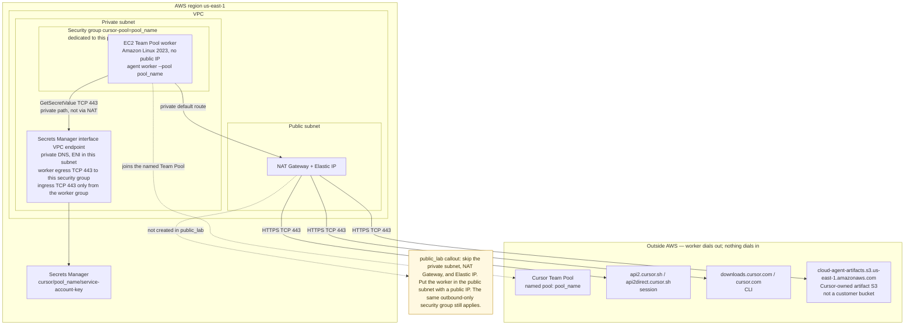

# Phase A — one Team Pool worker

One Amazon Linux 2023 EC2 instance that joins a Cursor Team Pool. Terraform creates the instance, an empty Secrets Manager secret, and a security group tagged `cursor-pool=<pool_name>`. You put the service account key in the secret after apply. The key is never a Terraform variable, never in `terraform.tfvars`, and never written to state (there is no secret version resource).

Stack path: `phase-a/terraform/`.

## Operator path

1. **Allow Self-Hosted.** A team admin opens the Cloud Agents dashboard and turns on **Allow Self-Hosted Machines**. Leave **Require Self-Hosted Machines** off unless every Cloud Agent run should land on your workers. Create a service account API key for pool workers. Personal, user, team, and organization keys cannot start a pool worker.
2. **tfvars.** From `phase-a/terraform/`:

   ```bash
   cp terraform.tfvars.example terraform.tfvars
   ```

   Set `aws_region`, `pool_name`, `network_mode`, and `lab_egress`. Do not add the API key.
3. **apply.**

   ```bash
   terraform init
   terraform apply
   ```

4. **put-secret-value.** Write the key to a local file that is gitignored, then load it. Delete the file when the call succeeds.

   ```bash
   umask 077
   printf '%s' 'paste-the-service-account-key' > service-account-key.txt
   aws secretsmanager put-secret-value \
     --region us-east-1 \
     --secret-id "$(terraform output -raw secret_arn)" \
     --secret-string file://service-account-key.txt
   rm -f service-account-key.txt
   ```

   `terraform output put_secret_value_command` prints the same command for your region and secret ARN. The worker unit retries `GetSecretValue` until the value exists, then runs `agent worker --pool <pool_name> start`.
5. **verify.** In Cursor, the pool name shows a connected worker (any-repo, under the pool you set). On the instance, `/var/log/cursor-pool-worker.log` and `systemctl status cursor-pool-worker` show the agent process. Strict mode has no inbound SSH and no SSM endpoints; use `lab_egress = true` if you need Session Manager over the public SSM APIs, or check the dashboard only.
6. **destroy.**

   ```bash
   terraform destroy
   ```

   The lab default `secret_recovery_window_in_days` is `0`, so destroy deletes the secret immediately. Use 7 or more outside a lab.

## Networking

The default is `network_mode = "private_nat"` in `us-east-1`. The worker has no public IP. It dials out through a NAT gateway to Cursor's session hosts, CLI hosts, and Cursor-owned artifact bucket. GetSecretValue stays on the Secrets Manager interface endpoint and does not use the NAT gateway. Nothing on the internet opens a connection to the worker.



Workers need outbound HTTPS to the hosts in the [Team Pools networking section](https://cursor.com/docs/cloud-agent/self-hosted/pool#networking):

| Host | Why |
| --- | --- |
| `api2.cursor.sh`, `api2direct.cursor.sh` | Agent session |
| `downloads.cursor.com`, `cursor.com` | CLI install and updates |
| `cloud-agent-artifacts.s3.us-east-1.amazonaws.com` | Artifact uploads |

AWS security groups match IP addresses, not hostnames. At plan/apply time Terraform resolves each host's A records (`hashicorp/dns`) and allows TCP 443 only to those `/32`s. IPv6 is disabled on the instance so the CLI does not prefer an unallowed AAAA. DNS is allowed only to the VPC resolver (`<vpc>.2`) and `169.254.169.253`.

There is no inbound rule. The instance uses IMDSv2.

Those A records are a snapshot. If Cursor or the artifact bucket moves addresses, the strict worker cannot connect until you apply again. `lab_egress = true` also allows TCP 80 and 443 to `0.0.0.0/0` (git hosts, package registries, public SSM). The A-record rules stay in place either way.

The service account key is fetched from Secrets Manager through an interface endpoint in the worker subnet, with private DNS. The worker security group allows TCP 443 to the endpoint security group, plus the Cursor addresses above. The endpoint security group accepts 443 only from the worker group. Security groups are stateful, so return traffic is allowed.

The worker rule references the endpoint security group so a single plan and apply can succeed. The endpoint ENI ids and private IPs are created with the endpoint, and Terraform rejects `for_each` over values that are known only after apply (`Invalid for_each argument`). A security-group id is a normal reference, so it does not need a targeted apply, and it still limits TCP 443 to ENIs attached to that group. The worker subnet CIDR is also known at plan time. It is a wider allowance: `private_nat` uses a dedicated subnet, while `public_lab` places the worker in a shared public subnet. A customer-managed KMS key on the secret needs `kms:Decrypt` added to the instance role; the AWS-managed `aws/secretsmanager` key does not.

### public_lab and private_nat

| `network_mode` | Worker placement | Egress path |
| --- | --- | --- |
| `private_nat` (default) | New private subnet in that VPC, no public IP | NAT gateway in the public subnet |
| `public_lab` | Default VPC, a public subnet, a public IP | Internet gateway, still filtered by the security group |

`private_nat` is the default and the recommended path for an enterprise-shaped dry-run. It bills a NAT gateway and an Elastic IP for as long as the stack exists. `public_lab` stays available when you want to skip that NAT cost on a throwaway lab. Both modes use the default VPC unless you set `vpc_id`. The private subnet CIDR defaults to a `/24` near the top of the VPC range (`cidrsubnet(vpc, 8, 250)`); set `private_subnet_cidr` if that range is taken.

`private_dns_enabled` on the Secrets Manager endpoint fails if the VPC already has an endpoint for that service. Point `vpc_id` at a lab VPC, or remove the existing endpoint before apply.

## Group for workers

The pool name is the group. `pool_name` is passed to `agent worker --pool`, and the worker security group (and the instance, via default tags) carries `cursor-pool=<pool_name>`. Find the group with:

```bash
aws ec2 describe-security-groups \
  --filters Name=tag:cursor-pool,Values=lab \
  --query 'SecurityGroups[].GroupId'
```

Phase A starts one any-repo worker with `--worker-dir` and no `--name`, so a later change can add `--clone-git-repos`. That flag needs git on the image, GitHub token minting enabled by a team admin, and a path to `github.com` (`lab_egress = true`, or extra hosts added to `cursor_hosts`). It cannot be combined with a machine `--name` or the pool name `default`. This stack rejects `pool_name = "default"`.

Strict mode does not open `github.com`. The worker can register and wait for a claim. A claim that must clone will fail until egress allows the git host.

## What apply creates

- One AL2023 EC2 worker and an instance profile that can `secretsmanager:GetSecretValue` on this secret only
- An empty Secrets Manager secret (`cursor/<pool_name>/service-account-key` unless `secret_name` is set)
- A worker security group tagged `cursor-pool=<pool_name>`, no inbound, egress as above
- A Secrets Manager interface endpoint
- In `private_nat` mode, a private subnet, route table, and NAT gateway

It does not create a secret version, a `terraform.tfvars` with the key, or inbound access.
